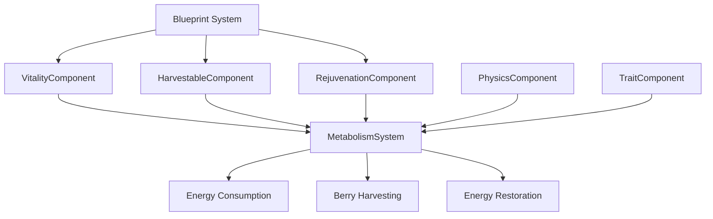

# Energy Restoration System Design

## Overview

The Energy Restoration System extends the existing metabolism framework by enabling entities to harvest berries from blueberry bushes and consume them for energy restoration. This system integrates seamlessly with the current ECS architecture, building upon the existing VitalityComponent, TraitComponent, and MetabolismSystem while introducing new HarvestableComponent and RejuvenationComponent functionality.

The design follows the established patterns in AI.Odin, using blueprint-driven configuration, component composition, and system-based processing to create emergent survival behaviors where entities actively seek energy sources when needed.

## Architecture

### System Integration Overview

```
MetabolismSystem (Enhanced)
├── Existing Energy Consumption Logic
├── NEW: Berry Harvesting Logic
│   ├── Proximity Detection
│   ├── Harvest Validation
│   └── Berry Consumption
└── Energy Clamping & Death Processing

EntityManager
├── Spatial Queries for Harvestable Entities
└── Component-based Entity Filtering

Blueprint System
├── HarvestableComponent Configuration
├── RejuvenationComponent Configuration
└── Existing VitalityComponent Extensions
```

### Component Relationships



## Components and Interfaces

### Enhanced VitalityComponent

**Current Implementation:**
```csharp
public class VitalityComponent : IComponent
{
    public bool IsDead { get; set; }
    public float Energy { get; set; }
}
```

**Enhanced Design:**
```csharp
public class VitalityComponent : IComponent
{
    public VitalityComponent()
    {
        this.IsDead = false;
        this.Energy = 50.0f;      // Start with half energy
        this.MaxEnergy = 100.0f;  // Maximum energy capacity
    }

    public bool IsDead { get; set; }
    public float Energy { get; set; }
    public float MaxEnergy { get; set; } = 100.0f;
    
    // Helper properties for energy management
    public bool IsEnergyFull => Energy >= MaxEnergy;
    public float EnergyPercentage => MaxEnergy > 0 ? Energy / MaxEnergy : 0f;
}
```

### HarvestableComponent Implementation

**Design:**
```csharp
public class HarvestableComponent : IComponent
{
    public string TargetId { get; set; } = "Berry";          // Type of resource produced
    public int Amount { get; set; } = 8;                     // Number of resources available
    public bool IsEmpty { get; set; } = false;               // Whether harvested resources remain
    public float HarvestRadius { get; set; } = 16.0f;        // Proximity required for harvesting
}
```

**Properties:**
- **TargetId**: Identifies the type of resource (e.g., "Berry", "Fruit")
- **Amount**: Current number of harvestable items remaining
- **IsEmpty**: Cached flag for quick empty state checking
- **HarvestRadius**: Distance within which entities can harvest (in world units)

### RejuvenationComponent Implementation

**Design:**
```csharp
public class RejuvenationComponent : IComponent
{
    public float Energy { get; set; } = 10.0f;  // Energy provided when consumed
    public bool IsConsumed { get; set; } = false;  // Whether this item has been consumed
}
```

**Properties:**
- **Energy**: Amount of energy restored when consumed
- **IsConsumed**: State flag for tracking consumption (future extensibility)

## Data Models

### Blueprint Configuration Schema

**Bush Entity Blueprint:**
```yaml
- id: 'BlueberryBush'
  component-blueprints:
    - id: 'Vitality'
    - id: 'Physics'
    - id: 'Harvestable'
      parameter:
        'TargetId': 'Berry'
        'Amount': 8
        'HarvestRadius': 16.0
    - id: 'Rendering'
      parameter:
        'SpriteSheetBlueprintId': 'Bush'
        'TextureName': 'entity-placeholder-8x8'
```

**Berry Configuration Blueprint:**
```yaml
- id: 'Blueberry'
  component-blueprints:
    - id: 'Rejuvenation'
      parameter:
        'Energy': 10.0
```

**Enhanced Human Entity Blueprint:**
```yaml
id: 'Human'
component-blueprints:
  - id: 'Trait'
    parameter:
      'EnergyConsumptionRateByEntityStateLookup': <Lookup> (Idling:2, Walking:3, Running:5)
  - id: 'Vitality'
    parameter:
      'MaxEnergy': 100.0
  - id: 'Physics'
  - id: 'Intelligence'
  - id: 'Rendering'
    parameter:
       'SpriteSheetBlueprintId': 'Humanoid'
       'TextureName': 'entity-placeholder-16x16'
```

### Energy Flow Model

```
Entity Energy State
├── Current Energy (0-100)
├── Maximum Energy (blueprint configured)
├── Energy Consumption (per tick, state-based)
└── Energy Restoration (berry consumption)

Berry Harvesting Flow
├── Proximity Check (distance <= harvest radius)
├── Availability Check (amount > 0, not empty)
├── Energy Need Check (current < maximum)
├── Harvest Action (amount--, energy++)
└── State Update (empty flag if amount == 0)
```

## Error Handling

### Defensive Programming Strategies

**Null Safety:**
```csharp
// Component validation
var vitalityComponent = entity.FindComponent<VitalityComponent>();
if (vitalityComponent == null) return; // Skip processing

// Collection safety
var harvestableEntities = EntityManager.FindEntitiesWithComponent<HarvestableComponent>();
if (harvestableEntities?.Any() != true) return; // No bushes available
```

**Boundary Validation:**
```csharp
// Energy clamping
vitalityComponent.Energy = Math.Max(0f, Math.Min(vitalityComponent.Energy, vitalityComponent.MaxEnergy));

// Distance validation
var distance = Vector2.Distance(entityPhysics.Position, bushPhysics.Position);
if (distance <= 0 || float.IsNaN(distance)) continue; // Invalid distance
```

**Blueprint Error Handling:**
```csharp
// Default value fallbacks
public float Energy { get; set; } = 10.0f;  // Default berry energy
public int Amount { get; set; } = 8;        // Default bush capacity
public float HarvestRadius { get; set; } = 16.0f; // Default harvest range
```

### Error Recovery Patterns

**Missing Components:**
- Log warning and continue processing other entities
- Use default values when blueprint parameters are missing
- Graceful degradation rather than system failure

**Invalid State Conditions:**
- Skip processing entities with invalid positions (NaN, infinite)
- Clamp energy values to valid ranges
- Reset empty flags if amount becomes positive again

## Testing Strategy

### Unit Testing Approach

**Component Testing:**
```csharp
[Test]
public void VitalityComponent_ShouldClampEnergyToMaximum()
{
    var component = new VitalityComponent { MaxEnergy = 100f };
    component.Energy = 150f; // Exceeds maximum
    
    // System should clamp to maximum
    Assert.That(component.Energy, Is.LessThanOrEqualTo(component.MaxEnergy));
}

[Test]
public void HarvestableComponent_ShouldMarkEmptyWhenAmountZero()
{
    var component = new HarvestableComponent { Amount = 1 };
    component.Amount = 0;
    
    // System should update empty flag
    Assert.That(component.IsEmpty, Is.True);
}
```

**System Integration Testing:**
```csharp
[Test]
public void MetabolismSystem_ShouldHarvestBerriesWhenNearBush()
{
    // Arrange: Entity near bush with low energy
    var entity = CreateEntityWithComponents<VitalityComponent, PhysicsComponent>();
    var bush = CreateBushEntity(position: entity.Position, berryCount: 5);
    
    // Act: Process metabolism system
    metabolismSystem.ProcessEntity(tick: 1, gameState, entity);
    
    // Assert: Energy increased, bush berry count decreased
    Assert.That(entity.VitalityComponent.Energy, Is.GreaterThan(initialEnergy));
    Assert.That(bush.HarvestableComponent.Amount, Is.EqualTo(4));
}
```

**Performance Testing:**
```csharp
[Test]
public void MetabolismSystem_ShouldMaintainPerformanceWith1000Entities()
{
    // Arrange: 1000 entities and 100 bushes
    var entities = CreateEntities(count: 1000);
    var bushes = CreateBushes(count: 100);
    
    // Act: Measure processing time
    var stopwatch = Stopwatch.StartNew();
    metabolismSystem.ProcessAllEntities(entities);
    stopwatch.Stop();
    
    // Assert: Processing completes within frame budget
    Assert.That(stopwatch.ElapsedMilliseconds, Is.LessThan(16)); // 60 FPS budget
}
```

### Integration Testing Scenarios

**Scenario 1: Normal Berry Harvesting**
1. Entity with 30% energy approaches bush with 5 berries
2. Entity harvests one berry per tick
3. Energy increases by berry value (10 energy)
4. Bush berry count decreases to 4
5. Process repeats until energy full or bush empty

**Scenario 2: Multiple Entities, Single Bush**
1. Three entities approach same bush simultaneously
2. Only one entity harvests per tick (first in processing order)
3. Other entities wait for next tick
4. Bush berries distributed fairly over time

**Scenario 3: Empty Bush Handling**
1. Bush starts with 1 berry remaining
2. Entity harvests final berry
3. Bush marked as empty (IsEmpty = true)
4. Subsequent entities skip empty bush
5. System performance unaffected by empty bushes

**Scenario 4: Full Energy Entity**
1. Entity at maximum energy (100/100)
2. Entity near bush with available berries
3. Entity skips harvesting (no energy need)
4. Bush berries remain unchanged
5. Entity continues normal behavior

### Performance Benchmarks

**Target Metrics:**
- **1000+ entities**: System processes all entities within 16ms frame budget
- **Spatial queries**: Bush proximity checks complete in <2ms
- **Memory allocation**: Zero allocations during steady-state processing
- **Cache efficiency**: Component access patterns optimized for CPU cache

**Optimization Strategies:**
- **Spatial partitioning**: Group entities by region for efficient proximity queries
- **Early exit conditions**: Skip processing when no energy restoration needed
- **Component caching**: Cache frequently accessed components
- **Batch processing**: Process similar entities together for cache efficiency